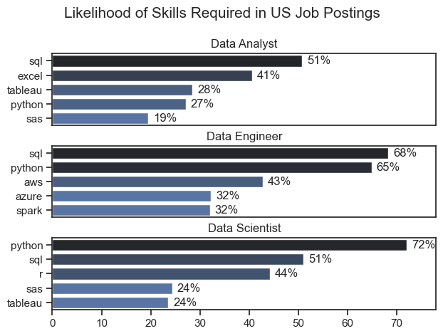
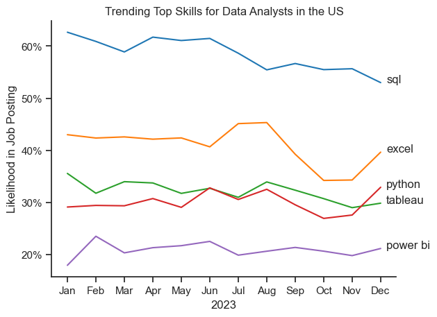
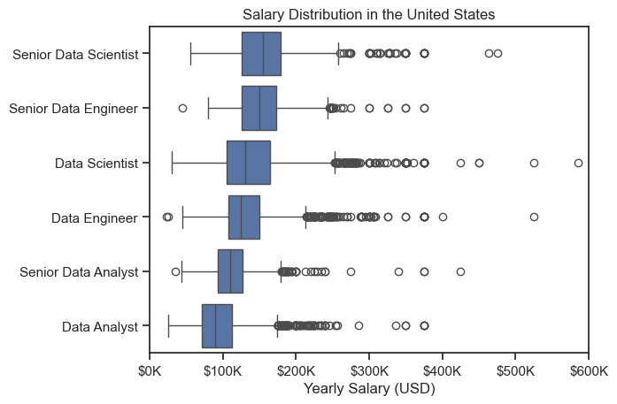
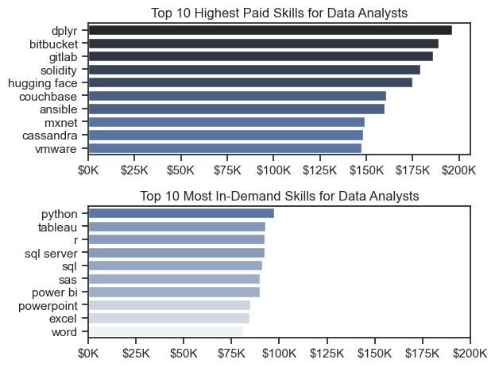
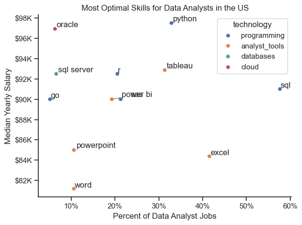

# The Introduction

Welcome to my analysis of the data job market from the 2023 year. This project was created out the desire to navigate and explore the job market in parallel with the want to help people understand the market. It delves into the top paying skills to the most in-demand skills to help find growth opportunities for Data Analysts to grow in. 

The data is sourced from Luke Barousse's Python Course which has taught me the fundamental skills in coding with python. Through my learning of different libraries like seaborn, matplotlib.pyplot, and pandas I've been able to create visual elemnts to help draw insights from the data. The visual elements cover Trends in skill usage in job postings to the most optimal skills to learn in order to get paid more. 

# Background

Below are the questions I wanted to answer for this project:

1. What are the skills most in-demand for the top 3 most popular data roles?
2. How are in-demand skills trending for Data Analysts?
3. How wel do jobs & skills pay for Data Analysts?
4. What is the most optimal skill to learn for Data Analysts. (HIGH demand and HIGH paying)

# Tools Used

- Python: The backbone of my analysis, inconjuction with the follow libraries:
  - Pandas Library: THis was used to analyze the data.
  - Matplotlib Library: Helped visualizing data.
  - Seaborn Library: Helped me create more advanced visuals.
- Jupyter Notebooks: The tool I used to run my Python scripts which let me easily include my notes and analysis.
- Visual Studio Code: My go-to for executing my python scripts
- Git & GitHub: Essential for version control and sharing my Python code and analysis.


# The Analysis

## 1. What are the most demanded skills for the top 3 most popular data role?

To find the most demanded skills for the top 3 most popular data roles. I filtered out those positions by which ones were the most popular, and got the top 5 skills for these top 3 roles. THis query highlights the most popular job titles and their top skills. I should pay attention to depending on the role I'm targeting.

View my notebook with detailed steps here: [2_Skills_Intro.ipynb](Project_Time/2_Skills_Intro.ipynb)

### Vizualize Data

``` 
fig, ax = plt.subplots(len(job_titles), 1)

sns.set_theme(style='ticks')

for i, job_title in enumerate(job_titles):
    df_plot = df_skills_perc[df_skills_perc['job_title_short'] == job_title].head(5)
    # df_plot.plot(kind='barh', x='job_skills', y='skill_percent', ax=ax[i], title=job_title)
    sns.barplot(data=df_plot, x='skill_percent', y='job_skills', ax=ax[i], hue='skill_count', palette='dark:b_r')
    ax[i].set_title(job_title)
    ax[i].set_ylabel('')
    ax[i].set_xlabel('')
    ax[i].get_legend().remove()
    ax[i].set_xlim(0,78)

    for n, v in enumerate (df_plot['skill_percent']):
        ax[i].text(v + 1, n, f'{v:.0f}%' ,va='center')
    
    if i != len(job_titles) - 1:
        ax[i].set_xticks([])


fig.suptitle('Likelihood of Skills Required in US Job Postings', fontsize=15)
fig.tight_layout(h_pad=0.5) # fix the overlap
plt.show()
```

### Results



### Insights

 
- SQL is the most common skill amongst Data Analyst, Data Engineers, and Data Scientist sitting at 51%, 68%, and 72% respectfully.

- Python is the second most common skill amongst these roles with a slight dip at 27% for Data Analyst roles. This may be due to the fact that Data Analysts require progrmas that are more data analytical and visualation centric.

- Data Engineers have 3 of their top 5 skills that are unique to only their role. This role seems to require more specialized programs then compared to Data Analyst and Data Scientists.
#### 

## 2. How are in-demand skills trending for Data Analysts?

### Visualize Data

```
df_plot = df_DA_US_percent.iloc[:, :5]

sns.lineplot(data=df_plot, dashes=False, palette='tab10')
sns.set_theme(style='ticks')
sns.despine()

plt.title('Trending Top Skills for Data Analysts in the US')
plt.ylabel('Likelihood in Job Posting')
plt.xlabel('2023')
plt.legend().remove()


from matplotlib.ticker import PercentFormatter
ax = plt.gca()
ax.yaxis.set_major_formatter(PercentFormatter(decimals=0))

for i in range(5):
    plt.text(11.2,df_plot.iloc[-1, i], df_plot.columns[i])

plt.show()
```

### Results


*Bar graph visualizing the trending top skills for data analysts in the US in 2023.*

### Insights

-  SQL is the top skill for data analyst starting the year at 63% and dropping to 53% by the end of the year.

- Excel and Python saw some heavy fluctuations in the 2nd half of the year but saw the the most dramatic increases during the months of November and December. Excel increased its likelihood by 5.2% and Python increased by 5.3%.

- Power Bi and Tableau remained relatively stable throughout the 2023 with slight increases towards the end of the year.

## 3. How well do jobs and skills pay for Data Analysts?

### Salary Analysis for Data Nerds

```
sns.boxplot(data=df_US_top6, x='salary_year_avg', y='job_title_short', order = job_order)
sns.set_theme(style='ticks')

plt.title('Salary Distribution in the United States')
plt.xlabel('Yearly Salary (USD)')
plt.ylabel('')
plt.xlim(0, 600000)
ticks_x = plt.FuncFormatter(lambda y, pos:f'${int(y/1000)}K')
plt.gca().xaxis.set_major_formatter(ticks_x)
plt.show() 
```

#### Results


*Box plot visualizing in the salary distributions for the top 6 data job titles.*

#### Insights

- Looking at the median salaries, the top job titles in salary distributions are the Senior Data Scientist and Data Engineer roles at around 130K USD. However, the entry and mid level title of Data Scientists and Enginers have shown outlier salaries that are significantly higher than their senior positions at 500K and 600K. Showing that an expertise in a very niche and desired skill can be compensated more without senior experience.

- The Senior Data Analyst roles recieves less compensation through the year than Data Scientists and Data engineers on the median. Making a increased incestive to jump from being a Data Analyst to either a Data Scientist or Data Engineer when making a new step in your career.

### Highest Paid & Most Demanded Skills for Data Analysts

### Visualize Data

```

fig, ax = plt.subplots(2, 1)

sns.set_theme(style='ticks')

#Top 10 Highest Paid Skills for Data Analysts
sns.barplot(data=df_DA_top_pay, x='median', y=df_DA_top_pay.index, hue='median', ax=ax[0], palette='dark:b_r')
ax[0].legend().remove()
ax[0].set_title('Top 10 Highest Paid Skills for Data Analysts')
ax[0].set_ylabel('')
ax[0].set_xlabel('')
ax[0].xaxis.set_major_formatter(plt.FuncFormatter(lambda x, _: f'${int(x/1000)}K'))

#Top 10 Most In-Demand Skills for Data Analysts
sns.barplot(data=df_DA_skills, x='median', y=df_DA_skills.index, hue='median', ax=ax[1], palette='light:b')
ax[1].legend().remove()
ax[1].set_title('Top 10 Most In-Demand Skills for Data Analysts')
ax[1].set_ylabel('')
ax[1].set_xlabel('')
ax[1].xaxis.set_major_formatter(plt.FuncFormatter(lambda x, _: f'${int(x/1000)}K'))

plt.xlim(0, 200000)
plt.tight_layout()
plt.show()
```

### Results
In-demand skils for data analysts in the US:


*Two separa bar graphs visualizing the highest paid skills and most in-demand skilsl for data analysts in the US.*

### Insights

- The gap between cloud softwares that are more specializaed compared to programming/vizualation/microsoft software ware is significant when it comes to compensation. The 10th highest cloud software is compensated around 150k  while the 10th highest non-cloud software is around 80k. It's safe to say that learning niche cloud programs will be compensated more, however, these skills may not be in demand as much as the lower paying non-cloud softwares.

- Programming and Visualation Softwares (python, tableau, sql) are on average more compesated then microsoft softwares (power bi, powerpoint, excel, word). Although this insight may not be as significant due to the gap being around 15K from top to bottom.

## 4. What is the most optimal skill to learn for Data Analysts?

### Visualize Data

```

# df_plot.plot(kind='scatter', x='skill_percent', y='median_salary')
sns.scatterplot(
    data=df_plot,
    x='skill_percent',
    y='median_salary',
    hue='technology'

)

sns.despine()
sns.set_theme(style='ticks')
# Prepare texts for adjust Text

texts=[]
for i, txt in enumerate(df_DA_skills_high_demand.index):
    texts.append(plt.text(df_DA_skills_high_demand['skill_percent'].iloc[i], df_DA_skills_high_demand['median_salary'].iloc[i], str(df_DA_skills_high_demand.index[i])))

# Adjust text to avoid overlap
adjust_text(texts, arrowprops=dict(arrowstyle='->', color='gray'))

# Set axis labels, title, and legend
plt.xlabel('Percent of Data Analyst Jobs')
plt.ylabel('Median Yearly Salary')
plt.title('Most Optimal Skills for Data Analysts in the US')


from matplotlib.ticker import PercentFormatter
ax = plt.gca()
ax.yaxis.set_major_formatter(plt.FuncFormatter(lambda y, pos: f'${int(y/1000)}K'))
ax.xaxis.set_major_formatter(PercentFormatter(decimals=0))

# Adjust layout and display plot
plt.tight_layout()
plt.show()

```

### Results


*A scatter plot visualizing the most optimal skills (high paying & high demand) for data analysts in the US.*

### Insights

- The scatter plot showed that programming skills (colored in blue) are clustered around high median salaries than analyst_tools (colored in yellow). The range for programming tools are from 90k - 98k while the analyst tools are 82k to 93k. 

# What you learned

- Data Inconsistencies: Handling missing or inconsistent data entries requires careful consideration and thorough techniques to ensure the integrity  of the analysis. 

- Complex Data Visualization: Designing effect visual representation of complex datasets was challenging in conveying insights clrealy and compellingly.

- Balancing Breadth and Depth: Deciding how deeply to dive into each analysis while maintaining a broad overall landscape required constant balancing to ensure comprehensive coverage without getting lost in details.

# Insights

This project provided several insights into the data job market:

- Skill Demand and Salary Correlation: There is a clear correlation between the demand for specific skills and the salaries there skills command. Advanced and specialized skills like Python and Oracle often lead to higher Salaries.

- Market Trends: There are changing trends in skills demand, highlighting the dynamic nature of the data job market. Keeping up with these trends is essential for career growth in data analytics

- Economic Value of Skills: Understanding which skills are both in-demand and will-compensated can guide data danalysts in prioritizing learning to maximize their encomic returns.

# Conclusion

This exploration on the data jbo market has been incredibly informative, highlighting the critical skills needed to achieve the highest paying job titles. Gathering my own insights this project has personally influenced my career trajectory. Personally, I will be purusing python data projects, with the intentions to eventually pursue a masters' degree in data science. This project has also proved to be a valuable foundation for future opportunities and growth within the data job market and community.
