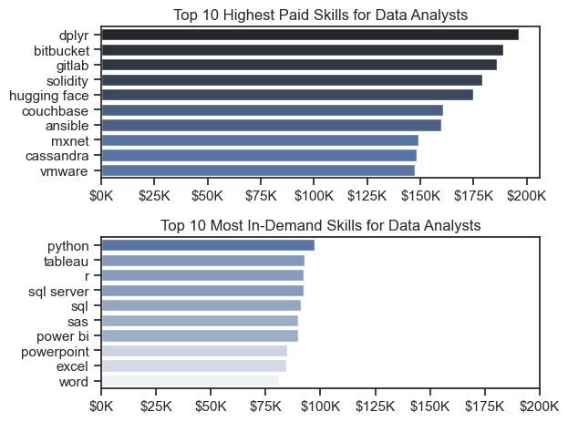
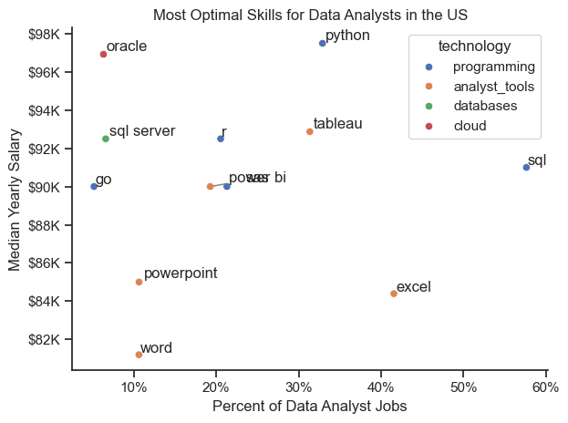

TODO: Need to fill this in.
# The Analysis

## 1. What are the most demanded skills for the top 3 most popular data role?

To find the most demanded skills for the top 3 most popular data roles. I filtered out those positions by which ones were the most popular, and got the top 5 skills for these top 3 roles. THis query highlights the most popular job titles and their top skills. I should pay attention to depending on the role I'm targeting.

View my notebook with detailed steps here: [2_Skills_Intro.ipynb](/Users/jackkennedy/Python_Data_Project/Project Time/2_Skills_Intro.ipynb)

### Vizualize Data

'''
fig, ax = plt.subplots(len(job_titles), 1)

sns.set_theme(style='ticks')

for i, job_title in enumerate(job_titles):
    df_plot = df_skills_perc[df_skills_perc['job_title_short'] == job_title].head(5)
    # df_plot.plot(kind='barh', x='job_skills', y='skill_percent', ax=ax[i], title=job_title)
    sns.barplot(data=df_plot, x='skill_percent', y='job_skills', ax=ax[i], hue='skill_count', palette='dark:b_r')
    ax[i].set_title(job_title)
    ax[i].set_ylabel('')
    ax[i].set_xlabel('')
    ax[i].get_legend().remove()
    ax[i].set_xlim(0,78)

    for n, v in enumerate (df_plot['skill_percent']):
        ax[i].text(v + 1, n, f'{v:.0f}%' ,va='center')
    
    if i != len(job_titles) - 1:
        ax[i].set_xticks([])

fig.suptitle('Likelihood of Skills Required in US Job Postings', fontsize=15)
fig.tight_layout(h_pad=0.5) # fix the overlap
plt.show()
'''

### Results

![Visualization of Top Skills for Data Nerds]
(Project Time/Images/skill_demand_percentages.png)

## 2. How are in-demand skills trending for Data Analysts?

### Visualize Data

'''
df_plot = df_DA_US_percent.iloc[:, :5]

sns.lineplot(data=df_plot, dashes=False, palette='tab10')
sns.set_theme(style='ticks')
sns.despine()

plt.title('Trending Top Skills for Data Analysts in the US')
plt.ylabel('Likelihood in Job Posting')
plt.xlabel('2023')
plt.legend().remove()

from matplotlib.ticker import PercentFormatter
ax = plt.gca()
ax.yaxis.set_major_formatter(PercentFormatter(decimals=0))

for i in range(5):
    plt.text(11.2,df_plot.iloc[-1, i], df_plot.columns[i])

plt.show()
'''

### Results

![Trending Top Skills for Data Analysts in the US]
(Project Time/Images/Trending_Top_Skills.png)
*Bar graph visualizing the trending top skilsl for data analysts in the US in 2023.*

## 3. How well do jobs and skills pay for Data Analysts?

### Salary Analysis for Data Nerds

'''
sns.boxplot(data=df_US_top6, x='salary_year_avg', y='job_title_short', order = job_order)
sns.set_theme(style='ticks')

plt.title('Salary Distribution in the United States')
plt.xlabel('Yearly Salary (USD)')
plt.ylabel('')
plt.xlim(0, 600000)
ticks_x = plt.FuncFormatter(lambda y, pos:f'${int(y/1000)}K')
plt.gca().xaxis.set_major_formatter(ticks_x)
plt.show() 
'''

### Results

!['Salary Distributions of Data Jobs in the US]
(Project Time/Images/Salary_Distribution_In_US.png)
*Box plot visualizing in the salary distributions for the top 6 data job titles.*

### Highest Paid & Most Demanded Skills for Data Analysts

### Visualize Data

'''

fig, ax = plt.subplots(2, 1)

sns.set_theme(style='ticks')

#Top 10 Highest Paid Skills for Data Analysts
sns.barplot(data=df_DA_top_pay, x='median', y=df_DA_top_pay.index, hue='median', ax=ax[0], palette='dark:b_r')
ax[0].legend().remove()
ax[0].set_title('Top 10 Highest Paid Skills for Data Analysts')
ax[0].set_ylabel('')
ax[0].set_xlabel('')
ax[0].xaxis.set_major_formatter(plt.FuncFormatter(lambda x, _: f'${int(x/1000)}K'))

#Top 10 Most In-Demand Skills for Data Analysts
sns.barplot(data=df_DA_skills, x='median', y=df_DA_skills.index, hue='median', ax=ax[1], palette='light:b')
ax[1].legend().remove()
ax[1].set_title('Top 10 Most In-Demand Skills for Data Analysts')
ax[1].set_ylabel('')
ax[1].set_xlabel('')
ax[1].xaxis.set_major_formatter(plt.FuncFormatter(lambda x, _: f'${int(x/1000)}K'))

plt.xlim(0, 200000)
plt.tight_layout()
plt.show()

'''

#### Results
in-demand skilsl for data analysts in the US:

*Two separa bar graphs visualizing the highest paid skills and most in-demand skilsl for data analysts in the US.*

#### Insights:

## 4. What is the most optimal skill to learn for Data Analysts?

#### Visualize Data

'''
# df_plot.plot(kind='scatter', x='skill_percent', y='median_salary')
sns.scatterplot(
    data=df_plot,
    x='skill_percent',
    y='median_salary',
    hue='technology'

)

sns.despine()
sns.set_theme(style='ticks')
# Prepare texts for adjust Text

texts=[]
for i, txt in enumerate(df_DA_skills_high_demand.index):
    texts.append(plt.text(df_DA_skills_high_demand['skill_percent'].iloc[i], df_DA_skills_high_demand['median_salary'].iloc[i], str(df_DA_skills_high_demand.index[i])))

# Adjust text to avoid overlap
adjust_text(texts, arrowprops=dict(arrowstyle='->', color='gray'))

# Set axis labels, title, and legend
plt.xlabel('Percent of Data Analyst Jobs')
plt.ylabel('Median Yearly Salary')
plt.title('Most Optimal Skills for Data Analysts in the US')

from matplotlib.ticker import PercentFormatter
ax = plt.gca()
ax.yaxis.set_major_formatter(plt.FuncFormatter(lambda y, pos: f'${int(y/1000)}K'))
ax.xaxis.set_major_formatter(PercentFormatter(decimals=0))

# Adjust layout and display plot
plt.tight_layout()
plt.show()

'''

#### Results

*A scatter plot visualizing the most optimal skills (high paying & high demand) for data analysts in the US.*

#### Insights: